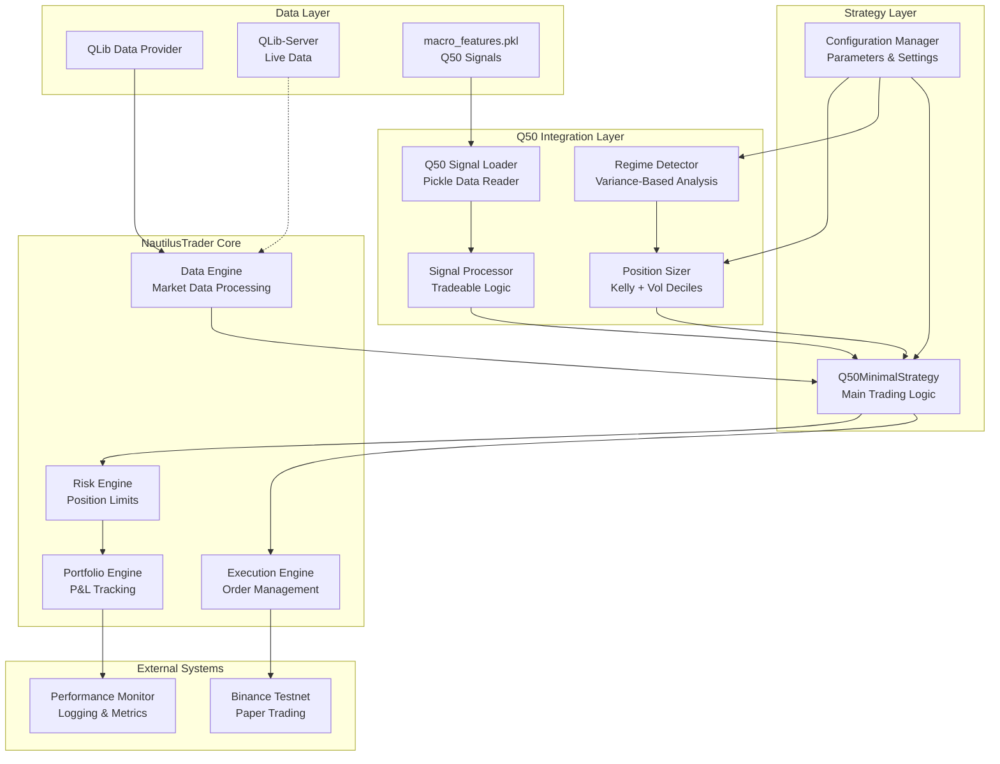
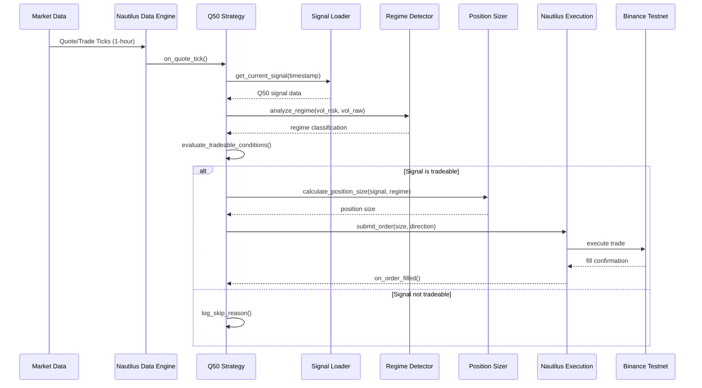

# Design Document

## Overview

This design document outlines the architecture for integrating our Q50-centric quantile trading system with NautilusTrader as a 2-week proof of concept. The integration will demonstrate that our existing Q50 system (achieving 1.327 Sharpe ratio) can be successfully deployed on NautilusTrader while maintaining performance quality and providing a foundation for future scalability.

The design leverages NautilusTrader's institutional-grade architecture to execute trades based on our variance-aware regime identification system, using 1-hour timeframes with QLib data integration. The POC will validate technical feasibility, performance characteristics, and implementation complexity before committing to full production deployment.

## Architecture

### High-Level System Architecture



### Component Integration Flow



## Components and Interfaces

### 1. Q50 Signal Loader

**Purpose:** Load and manage Q50 signals from our existing pickle data files.

**Interface:**
```python
class Q50SignalLoader:
    def __init__(self, signal_file_path: str):
        """Initialize with path to macro_features.pkl"""
        
    def load_signals(self) -> pd.DataFrame:
        """Load Q50 signals with validation"""
        
    def get_signal_for_timestamp(self, timestamp: pd.Timestamp) -> Optional[Dict]:
        """Get Q50 signal for specific timestamp with 5-minute tolerance"""
        
    def validate_signal_columns(self, df: pd.DataFrame) -> bool:
        """Validate required columns exist"""
        
    def get_latest_signal(self) -> Optional[Dict]:
        """Get most recent available signal"""
```

**Key Features:**
- Validates presence of required columns: q10, q50, q90, vol_raw, vol_risk, prob_up, economically_significant, high_quality, tradeable
- Handles timestamp matching with 5-minute tolerance for 1-hour data
- Provides fallback to latest signal when exact match unavailable
- Thread-safe signal access for concurrent strategy execution

### 2. Regime Detector

**Purpose:** Implement variance-based regime identification using vol_risk and vol_raw deciles.

**Interface:**
```python
class RegimeDetector:
    def __init__(self, config: Dict):
        """Initialize with regime thresholds and parameters"""
        
    def classify_volatility_regime(self, vol_risk: float, vol_raw: float) -> Dict:
        """Classify current volatility regime"""
        
    def get_vol_raw_decile(self, vol_raw: float) -> int:
        """Convert vol_raw to decile rank (0-9)"""
        
    def calculate_regime_multipliers(self, regime: Dict) -> Dict:
        """Calculate position sizing multipliers based on regime"""
        
    def get_enhanced_info_ratio_threshold(self, regime: Dict) -> float:
        """Get regime-adjusted info ratio threshold"""
```

**Key Features:**
- Uses vol_risk as variance measure for superior risk assessment
- Implements vol_raw decile classification with predefined thresholds
- Provides regime-specific multipliers for position sizing
- Supports variance-based regime transitions (low/medium/high/extreme)

### 3. Signal Processor

**Purpose:** Convert Q50 signals into actionable trading decisions using our regime-aware logic.

**Interface:**
```python
class SignalProcessor:
    def __init__(self, config: Dict):
        """Initialize with trading thresholds and parameters"""
        
    def evaluate_tradeable_conditions(self, signal: Dict, regime: Dict) -> bool:
        """Determine if signal meets trading criteria"""
        
    def determine_trade_direction(self, signal: Dict) -> Optional[str]:
        """Determine BUY/SELL/HOLD based on Q50 logic"""
        
    def calculate_signal_strength(self, signal: Dict, regime: Dict) -> float:
        """Calculate regime-adjusted signal strength"""
        
    def validate_economic_significance(self, signal: Dict) -> bool:
        """Check if signal exceeds economic thresholds"""
```

**Key Features:**
- Implements our tradeable logic: economically_significant AND high_quality
- Uses enhanced_info_ratio for superior signal quality assessment
- Applies regime-aware signal strength adjustments
- Validates expected value exceeds transaction costs (5 bps)

### 4. Position Sizer

**Purpose:** Implement Kelly-based position sizing with variance-aware volatility adjustments.

**Interface:**
```python
class PositionSizer:
    def __init__(self, config: Dict):
        """Initialize with base sizing parameters"""
        
    def calculate_position_size(self, signal: Dict, regime: Dict, account_balance: float) -> float:
        """Calculate optimal position size using Kelly + regime adjustments"""
        
    def apply_vol_decile_adjustments(self, base_size: float, vol_decile: int) -> float:
        """Apply volatility decile-based risk adjustments"""
        
    def apply_regime_multipliers(self, size: float, regime: Dict) -> float:
        """Apply variance-based regime multipliers"""
        
    def validate_risk_limits(self, position_size: float, max_position: float) -> float:
        """Ensure position size within risk limits"""
```

**Key Features:**
- Base Kelly sizing: 10% capital × min(|q50| × 100, 2.0)
- Vol decile adjustments: extreme high (0.6x), high (0.85x), low (1.1x)
- Variance regime multipliers: low variance (+10%), extreme variance (-60%)
- Maximum position cap at 50% of available capital

### 5. Q50 Minimal Strategy

**Purpose:** Main NautilusTrader strategy implementing Q50 trading logic.

**Interface:**
```python
class Q50MinimalStrategy(Strategy):
    def __init__(self, config: StrategyConfig):
        """Initialize strategy with Q50 components"""
        
    def on_start(self):
        """Strategy initialization and data subscriptions"""
        
    def on_quote_tick(self, tick: QuoteTick):
        """Process market data and execute Q50 signals"""
        
    def on_order_filled(self, event: OrderFilled):
        """Handle order fill events and position tracking"""
        
    def on_stop(self):
        """Strategy shutdown and performance reporting"""
```

**Key Features:**
- Inherits from NautilusTrader Strategy base class
- Processes 1-hour market data ticks
- Integrates all Q50 components for signal-to-execution flow
- Maintains position tracking and performance metrics

## Data Models

### Q50 Signal Data Structure

```python
@dataclass
class Q50Signal:
    timestamp: pd.Timestamp
    q10: float                    # 10th percentile prediction
    q50: float                    # 50th percentile (median) prediction
    q90: float                    # 90th percentile prediction
    vol_raw: float               # Raw volatility (6-day realized vol)
    vol_risk: float              # Variance measure (vol_raw²)
    prob_up: float               # Probability of upward movement
    economically_significant: bool # Exceeds transaction cost threshold
    high_quality: bool           # Meets enhanced info ratio threshold
    tradeable: bool              # Final trading decision flag
    
    # Regime features
    vol_raw_decile: int          # Volatility decile rank (0-9)
    variance_regime_low: bool    # Low variance regime flag
    variance_regime_high: bool   # High variance regime flag
    variance_regime_extreme: bool # Extreme variance regime flag
    
    # Enhanced metrics
    enhanced_info_ratio: float   # Signal / total_risk
    expected_value: float        # Probability-weighted expected return
    signal_thresh_adaptive: float # Regime-adjusted threshold
```

### Regime Classification

```python
@dataclass
class RegimeClassification:
    vol_decile: int              # Volatility decile (0-9)
    variance_regime: str         # low/medium/high/extreme
    momentum_regime: str         # trending/ranging
    regime_stability: int        # Periods in current regime
    
    # Multipliers
    position_multiplier: float   # Position sizing adjustment
    threshold_multiplier: float  # Signal threshold adjustment
    info_ratio_threshold: float  # Quality threshold adjustment
```

### Trading Decision

```python
@dataclass
class TradingDecision:
    action: str                  # BUY/SELL/HOLD
    position_size: float         # Calculated position size
    signal_strength: float       # Regime-adjusted strength
    confidence: float            # Directional confidence
    regime: RegimeClassification # Current regime context
    
    # Execution details
    order_type: str             # MARKET/LIMIT
    price_adjustment: float     # Slippage adjustment
    risk_metrics: Dict          # Risk assessment data
```

## Error Handling

### Signal Loading Errors

```python
class SignalLoadingError(Exception):
    """Raised when Q50 signals cannot be loaded"""
    
class SignalValidationError(Exception):
    """Raised when signal data fails validation"""
    
class TimestampMismatchError(Exception):
    """Raised when no signal found for timestamp"""
```

**Error Handling Strategy:**
- Signal loading failures: Log error, attempt to use cached signals, graceful degradation
- Missing columns: Validate at startup, fail fast with clear error messages
- Timestamp mismatches: Use 5-minute tolerance, fallback to latest signal
- Invalid signal values: Skip signal, log validation failure, continue processing

### Trading Execution Errors

```python
class PositionSizingError(Exception):
    """Raised when position size calculation fails"""
    
class RegimeClassificationError(Exception):
    """Raised when regime detection fails"""
    
class OrderExecutionError(Exception):
    """Raised when order submission fails"""
```

**Error Handling Strategy:**
- Position sizing failures: Default to 10% base size, log calculation error
- Regime classification errors: Use default regime, continue with conservative settings
- Order execution failures: Log failure, continue processing subsequent signals
- Risk limit violations: Reject trade, log violation reason, maintain system stability

## Testing Strategy

### Unit Testing

**Q50 Signal Loader Tests:**
- Test signal loading from pickle files
- Validate column presence and data types
- Test timestamp matching with tolerance
- Test error handling for corrupted data

**Regime Detector Tests:**
- Test vol_raw decile classification
- Validate regime multiplier calculations
- Test regime transition detection
- Test enhanced info ratio thresholds

**Position Sizer Tests:**
- Test Kelly sizing calculations
- Validate vol decile adjustments
- Test regime multiplier applications
- Test risk limit enforcement

### Integration Testing

**Strategy Integration Tests:**
- Test complete signal-to-execution flow
- Validate NautilusTrader component integration
- Test error propagation and recovery
- Test performance under various market conditions

**Data Integration Tests:**
- Test QLib data provider integration
- Validate 1-hour timeframe processing
- Test qlib-server compatibility (future)
- Test data continuity and gap handling

### Performance Testing

**Latency Testing:**
- Measure signal processing latency (target: <30 seconds)
- Test order execution speed
- Validate system responsiveness under load
- Test memory usage and stability over 24+ hours

**Accuracy Testing:**
- Compare POC results with backtesting performance
- Validate signal interpretation accuracy
- Test regime classification consistency
- Measure slippage and execution quality

## Configuration Management

### Strategy Configuration

```yaml
# config/q50_strategy_config.yaml
strategy:
  name: "Q50MinimalStrategy"
  instrument_id: "BTCUSDT.BINANCE"
  timeframe: "1H"
  
  # Signal parameters
  signal_threshold: 0.6
  base_position_size: 0.1
  max_position_size: 0.5
  
  # Risk parameters
  transaction_cost_bps: 5
  base_info_ratio: 1.5
  max_vol_decile_exposure: 0.6
  
  # Regime parameters
  variance_regime_thresholds:
    low: 0.30
    high: 0.70
    extreme: 0.90
  
  # Data parameters
  signal_file_path: "data3/macro_features.pkl"
  qlib_provider_uri: "/Projects/qlib_trading_v2/qlib_data/CRYPTO_DATA"
  qlib_server_enabled: false
```

### NautilusTrader Configuration

```python
# config/nautilus_config.py
from nautilus_trader.config import TradingNodeConfig

config = TradingNodeConfig(
    trader_id="Q50_POC_TRADER",
    strategies=[
        {
            "strategy_path": "strategies.q50_minimal_strategy:Q50MinimalStrategy",
            "config_path": "config.q50_strategy_config:Q50StrategyConfig",
        }
    ],
    data_engine={
        "qsize": 100000,
        "time_bars_build_with_no_updates": False,
        "time_bars_timestamp_on_close": True,
        "validate_data_sequence": True,
    },
    risk_engine={
        "bypass": False,
        "max_order_submit_rate": "10/00:01:00",  # 10 orders per minute
        "max_order_modify_rate": "10/00:01:00",
        "max_notional_per_order": {"USD": 100_000},
    },
    exec_engine={
        "reconciliation": True,
        "reconciliation_lookback_mins": 1440,
        "snapshot_orders": True,
        "snapshot_positions": True,
    },
    adapters=[
        {
            "adapter": "BinanceSpotDataClient",
            "config": {
                "testnet": True,  # Paper trading
                "base_url_ws": "wss://testnet.binance.vision/ws",
                "base_url_http": "https://testnet.binance.vision",
            }
        }
    ]
)
```

## Performance Monitoring

### Key Metrics

**Trading Performance:**
- Total trades executed
- Win rate by regime type
- Average holding period
- Sharpe ratio comparison with backtesting
- Maximum drawdown

**System Performance:**
- Signal processing latency
- Order execution latency
- Memory usage over time
- Error rates and recovery times
- System uptime and stability

**Regime Analysis:**
- Regime distribution over test period
- Performance by volatility decile
- Enhanced vs traditional info ratio effectiveness
- Position sizing accuracy by regime

### Monitoring Dashboard

```python
class PerformanceMonitor:
    def __init__(self):
        self.metrics = {
            'trades_by_regime': defaultdict(int),
            'pnl_by_regime': defaultdict(float),
            'signal_latencies': [],
            'execution_latencies': [],
            'error_counts': defaultdict(int),
        }
    
    def log_trade_execution(self, trade_data: Dict):
        """Log trade with regime context"""
        
    def log_signal_processing(self, processing_time: float):
        """Log signal processing performance"""
        
    def generate_performance_report(self) -> Dict:
        """Generate comprehensive performance report"""
        
    def export_metrics_to_csv(self, filepath: str):
        """Export metrics for analysis"""
```

This design provides a comprehensive foundation for the NautilusTrader POC while maintaining compatibility with our existing Q50 system and supporting future scalability requirements.